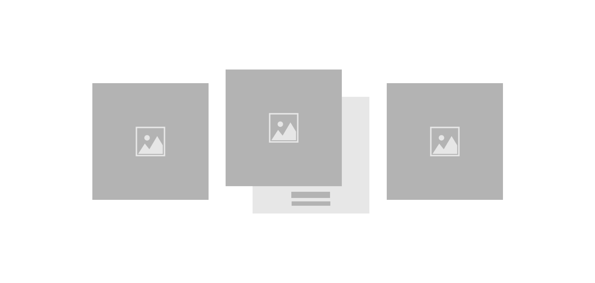

## Engage Your Users with Responsive Hover Cards, Redefined

<a href="https://www.linkedin.com/in/dharmendraverma95/" target="_blank">LinkedIn Profile </a>

<a href="https://www.behance.net/dhirukumar" target="_blank">Behance Profile </a>

## Project Overview
This project showcases a modern and dynamic Responsive Hover Card effect that enhances user experience on websites. With sleek animations and interactivity, the cards respond to user interaction by changing appearance when hovered over, making your site more engaging and visually appealing.

## Features
- Responsive Design: Cards automatically adjust to different screen sizes, ensuring a smooth experience across devices.
- Hover Animations: Cards feature smooth hover effects, including scaling, shadow, and color transitions.
- Easy Integration: Simple HTML, CSS, and JavaScript implementation to easily add to any website or web application.
- Customizable: Easy-to-edit styles for colors, animations, and layout to fit your website’s design.
  

###### Lang
<ul>
  <li>HTML5</li>
  <li>CSS3</li>
  <li>ChatGPT [For Content]</li>
  <li>Freepik [ for Images ]</li>
  <li>Desgin in Abode XD</li>
</ul>

 
Desktop Design 

 
Desktop UI UX Design 

 
Desktop Design UI UX Layout 

 
Desktop Design 

Cover 
